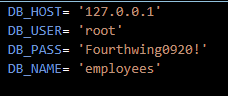

# Employee Management System

## Table of Contents
- [Overview](#overview)
- [Installation](#installation)
- [Usage](#usage)
- [Features](#features)
- [Dependencies](#dependencies)
- [Database-Schema](#data-schema)
- [Video-Demo](#video-demo)
- [License](#license)

### Installation
- Clone this repository to your local machine.
- Navigate to the project directory.
- Install dependencies by running npm install.
- Set up your MySQL database by executing the provided SQL schema and sample data in schema.sql.
- Create a .env file in the root directory and provide your MySQL database configuration:
-  

### Usage
To run the application, use the following command: `node index.js`

Once the application starts, you'll be presented with a series of prompts to interact with the system. You can perform various actions such as viewing employees, roles, and departments, adding new employees, roles, or departments, updating employee roles, and more.

### Features
- View all employees, roles, and departments.
- View employees by department or manager.
- Add new employees, roles, or departments.
- Remove employees, roles, or departments.
- Update employee roles or managers.

### Dependencies
- `inquirer`: For prompting user inputs.
- `mysql2`: MySQL client for Node.js.
- `dotenv`: For loading environment variables from a .env file.

### Database Schema
The database schema includes three tables:

- `department`: Stores department information.
- `role`: Stores role information with a reference to the department.
- `employee`: Stores employee information with references to their role and manager.

### Video Demo

## License
This project is licensed under the MIT License.
